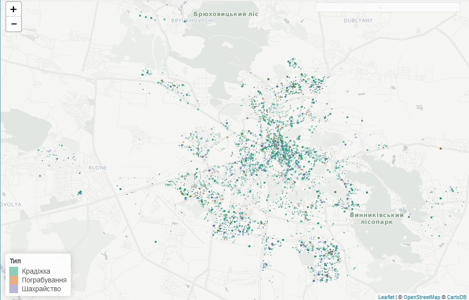
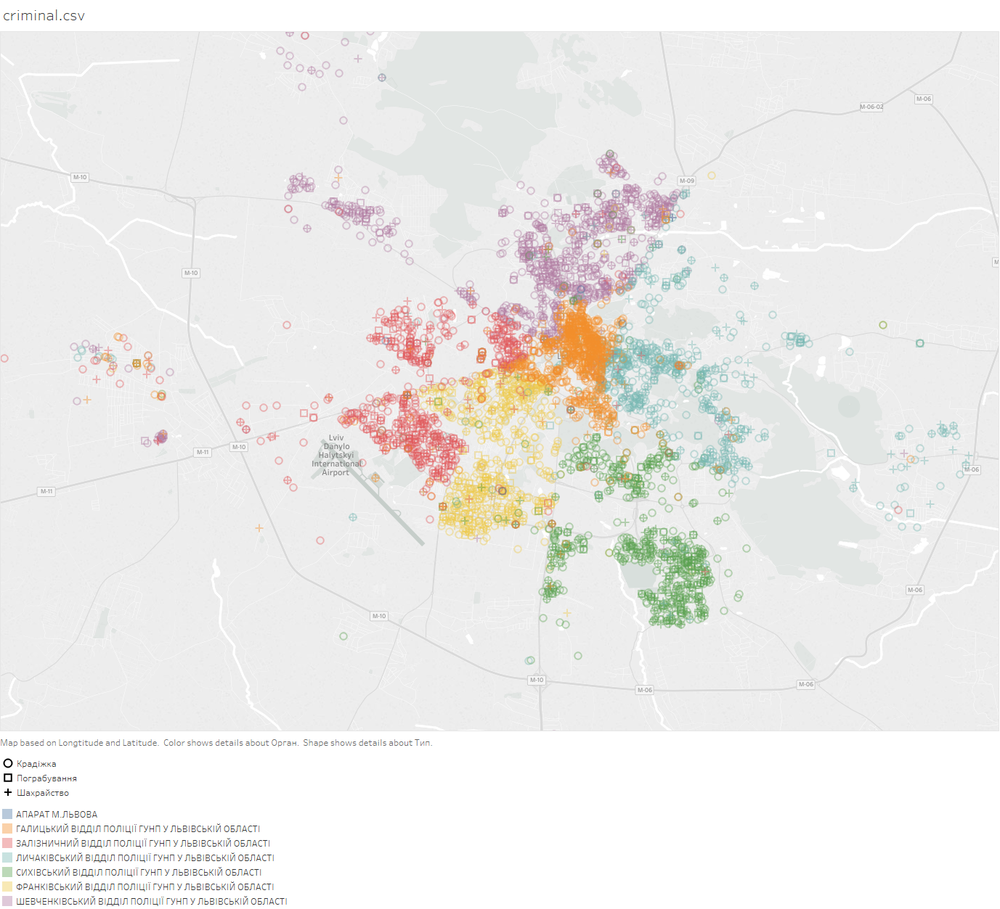

# lviv_criminal_map

An interactive map of criminal activity (thefts, robberies, frauds) in Lviv, Ukraine, built from the city's open data portal — a side project exploring whether public open data could answer a very practical question: which neighborhoods are safer to live in?

**Live demo:** https://anatolis.shinyapps.io/ShinyLeaflet/

## Data

Over 13,000 police-registered cases from 2015, sourced from the [Lviv Open Data Portal](http://opendata.city-adm.lviv.ua/). Each record's street address was geocoded to coordinates via the OpenStreetMap and Google Maps geocoding APIs (`geo.py`), then aggregated up to Lviv's district boundaries (extracted from Wikimapia, `district.geo.json`) to compute a per-district crime rate normalized by area and population.

## Approach

The analysis (see the notebooks below) went through a few iterations:
1. **Plot every case as a dot on the map** — turned out too noisy to reveal any pattern.
2. **Heatmap** — better, but still hard to read at city scale.
3. **District choropleth** — settled on this: districts colored on a green→red gradient by crime rate, which is the clearest way to compare areas at a glance.

| Raw case dots | Cases by police department |
|---|---|
|  |  |

## Notebooks

- `Data manipulations.ipynb` / `Data manipulations 2.ipynb` — fetching, cleaning, and geocoding the raw datasets
- `Lviv districts.ipynb` — building district boundary polygons
- `Initial EDA.ipynb` — first exploratory plots and color scheme choices
- `Conclusion.ipynb` — write-up of findings and design decisions

## App

`ShinyLeaflet/` contains the R Shiny + Leaflet app that serves the interactive map, with toggles for case type (theft/robbery/fraud) and view (dots/heatmap/by-district).

## Status

A university side project from 2017 — data is a one-year snapshot from 2015 and the app isn't actively maintained, but the live demo above still shows the visualization in action.
